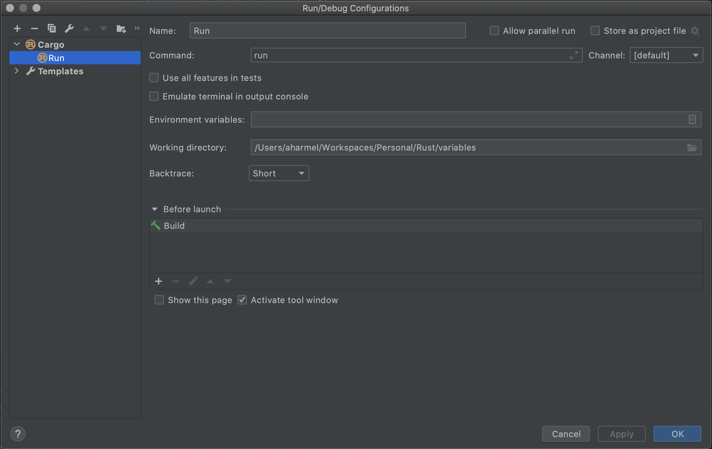
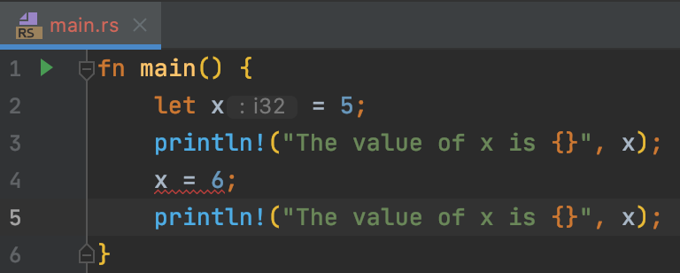
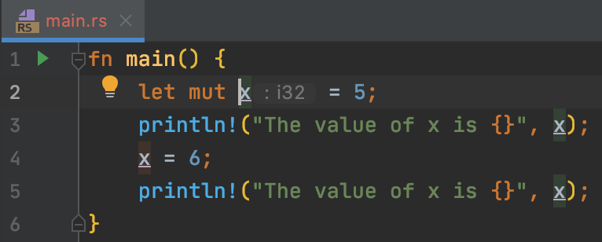

It personally helps me _loads_ if I have good IDE support when I'm learning a new language. The Jetbrains Rust plugins (which I'm using in IntelliJ IDEA, though they work in all their other IDEs too) are really very nice. 

The Run config dialog:

Hints / type info:

Mutable-variable flagging (underlining):

